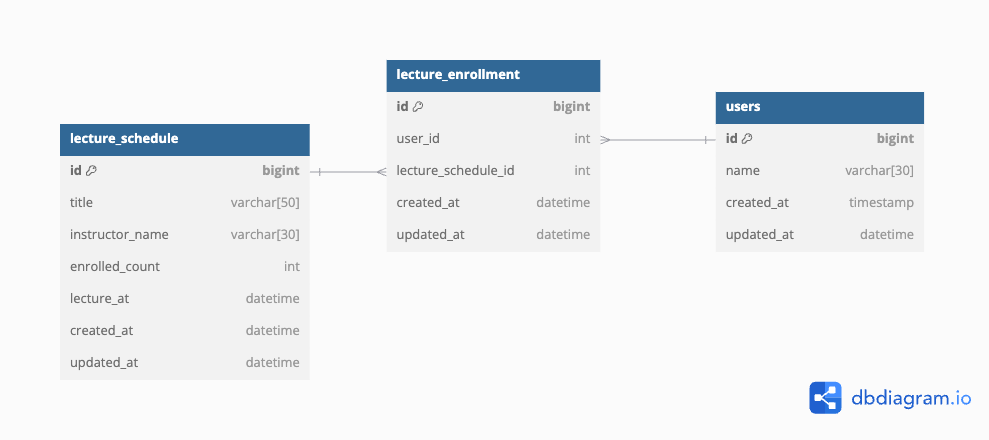

## 특강 신청 서비스 데이터베이스 설계

---

### ERD 설명

- 본 프로젝트의 ERD는 **lecture_schedule**, **lecture_enrollment**, **users** 세 개의 테이블로 구성됩니다.
- 각 테이블 간 관계:
    1. **lecture_schedule** ↔ **lecture_enrollment**: 1:N 관계 (특강 1개에는 여러 사용자가 신청 가능).
    2. **users** ↔ **lecture_enrollment**: 1:N 관계 (사용자 1명은 여러 강의에 신청 가능).

---

### 테이블 상세 설명

#### **lecture_schedule** (특강 테이블)
- **설명**: 특강 정보를 저장하는 테이블.
- **주요 컬럼**:
    - `id`: 특강 ID (Primary Key).
    - `title`: 특강 제목.
    - `instructor_name`: 강사 이름.
    - `enrolled_count`: 현재 특강 신청 인원 (수강 인원을 빠르게 확인하기 위해 사용).
    - `lecture_at`: 특강 진행 시간.
    - `created_at`, `updated_at`: 생성 및 수정 시간.
- **주요 기능**:
    - 특강 신청 인원(`enrolled_count`)을 관리하여 빠른 데이터 접근 가능.
    - 신청 가능한 특강의 시간 및 강사 정보를 제공.

---

#### **users** (사용자 테이블)
- **설명**: 사용자 정보를 저장하는 테이블.
- **주요 컬럼**:
    - `id`: 사용자 ID (Primary Key).
    - `name`: 사용자 이름.
    - `created_at`, `updated_at`: 사용자 계정 생성 및 수정 시간.
- **주요 기능**:
    - 사용자 별 특강 신청 기록을 관리.
    - 이름 기반 검색 및 조회 지원.

---

#### **lecture_enrollment** (특강 신청 테이블)
- **설명**: 사용자가 특정 특강을 신청한 정보를 저장.
- **주요 컬럼**:
    - `id`: 신청 ID (Primary Key).
    - `user_id`: 신청한 사용자 ID (Foreign Key, `users.id`).
    - `lecture_schedule_id`: 신청한 특강 ID (Foreign Key, `lecture_schedule.id`).
    - `created_at`, `updated_at`: 신청 기록 생성 및 수정 시간.
- **주요 기능**:
    - 사용자와 특강 간의 다대다(N:N) 관계를 관리.
    - 신청 기록을 통해 사용자별 수강 특강 이력 조회 가능.

---

### 외래 키(FK) 설정에 대한 고려 사항

- **ERD와 실제 DB 설계 차이점**:
    - ERD에는 관계를 명확히 표현하기 위해 외래 키(Foreign Key)를 사용한 연관관계를 명시했습니다.
    - 하지만 **실제 데이터베이스 설계**에서는 **외래 키를 설정하지 않았습니다**.
    - 이유: 외래 키를 설정할 경우 트랜잭션 간에 **데드락(Deadlock)**이 발생할 가능성이 있기 때문입니다.

#### **데드락(Deadlock) 발생 가능성**
- 외래 키 제약 조건을 사용하면, 데이터베이스는 참조 무결성을 보장하기 위해 관련된 테이블에 대해 **락(Lock)**을 걸게 됩니다.
- 예를 들어:
    1. 하나의 트랜잭션이 `lecture_schedule` 테이블의 데이터를 수정하려고 락을 걸고,
    2. 동시에 다른 트랜잭션이 `lecture_enrollment` 테이블에서 해당 데이터를 참조하려고 락을 요청하면,
    3. 두 트랜잭션이 서로의 락 해제를 기다리며 **데드락(Deadlock)**이 발생할 수 있습니다.

- 특히, 비관적 락(Pessimistic Lock)을 함께 사용하는 경우 테이블 간 교차 락이 걸릴 확률이 높아집니다.
- 이를 방지하기 위해 외래 키를 제거하고, **애플리케이션 레벨에서 참조 무결성을 관리**하도록 설계하였습니다.

---

### 쓰기 연산과 조회 연산 간의 트레이드오프

- 데이터 설계 시 **쓰기 연산**과 **조회 연산** 간에는 다음과 같은 트레이드오프가 존재합니다:
    1. **쓰기 연산에 힘을 주면**:
        - 데이터 저장과 갱신에 많은 리소스가 소모됩니다.
        - 하지만, 조회 시 복잡한 조인이나 계산이 줄어들어 조회 비용이 낮아집니다.
    2. **조회 연산에 힘을 주면**:
        - 데이터를 효율적으로 검색할 수 있지만, 데이터를 저장하거나 갱신할 때 복잡성이 증가합니다.

- **일반적인 어플리케이션 개발**에서는 조회 연산이 쓰기 연산보다 훨씬 빈번하게 발생합니다.
    - 따라서, 대부분의 경우 **조회 비용을 줄이는 방향으로 설계를 최적화**합니다.
    - 본 프로젝트에서도 **쓰기 연산의 비용을 증가시키는 대신, 조회 성능을 최적화하는 방향으로 설계**를 진행하였습니다.

---

### 비정규화 설계 이유

#### 1. **비정규화 정의**
비정규화는 의도적으로 정규화를 깨뜨려 설계하는 방식으로, 아래와 같은 이유로 사용되었습니다:
1. **조인(Join)의 필요성을 줄여 성능 최적화**.
2. 쓰기 부하를 증가시키는 대신 읽기 부하를 감소시켜 조회 성능을 향상.
3. 데이터 구조의 복잡성을 낮출 수 있음.
4. 스냅샷(Snapshot) 형태로 데이터를 저장하여 관리가 용이.

#### 2. **정규화와 비정규화 작업**
- 정규화된 테이블을 비정규화하는 작업보다, 비정규화된 테이블을 정규화하는 작업이 상대적으로 용이합니다.
- 이를 고려하여 초기 설계에서는 성능 최적화를 위해 비정규화된 테이블 구조를 채택하였으며, 이후 요구사항에 따라 정규화로 변경할 가능성을 염두에 두었습니다.

#### 3. **강의와 강사 정보의 비정규화**
- 강의와 강사 정보를 더 정규화하여 별도의 테이블로 분리할 수도 있었으나, 현재 프로젝트의 요구사항에서는 **별도의 테이블이 불필요**하다고 판단하였습니다.
- 위에서 언급한 비정규화의 장점(성능 최적화, 데이터 간소화 등)을 고려하여 **lecture_schedule** 테이블 하나에 강의 및 강사 정보를 통합하여 설계하였습니다.

---

### `lecture_schedule` 테이블의 설계 결정

1. **신청 인원 관리 방식**:
    - 신청 인원을 관리하기 위해 두 가지 접근 방식을 고려했습니다:
        1. **`lecture_enrollment`의 연관 관계를 통해 `List.size()`로 계산**:
            - `lecture_enrollment` 테이블의 관련 데이터를 조인하여 신청 인원을 계산.
            - 하지만 이는 동시성 제어가 어려워지는 문제가 발생할 수 있음.
        2. **`enrolled_count` 컬럼을 사용**:
            - **비관적 락(Pessimistic Lock)**을 활용하여 **동시성 문제를 제어**하고, 신청 시 마다 `enrolled_count` 값을 업데이트.
            - 이를 통해 데이터베이스 수준에서 동시성 문제를 안정적으로 처리 가능.

    - **최종 선택**: 동시성 문제를 해결하기 위해 비관적 락을 사용하여 `enrolled_count` 컬럼을 업데이트.

2. **비관적 락과 동작 방식**:
    - 비관적 락(Pessimistic Lock)을 활용하면 데이터베이스의 **로우(Row)** 단위로 락이 걸립니다.
    - `lecture_schedule`의 특정 로우에 락을 걸어 다른 트랜잭션에서 동시에 해당 데이터를 수정하지 못하도록 제어합니다.
    - 이를 통해 동시성 충돌을 방지하고, 안정적으로 수강 인원을 관리할 수 있습니다.

3. **최대 수강 인원 (Max Capacity)**:
    - 비즈니스 정책에 따라 최대 수강 인원을 **30**으로 고정.
    - 이 값은 현재 고정되어있으므로, `lecture_schedule` 테이블에 별도 컬럼으로 두지 않고 어플리케이션 단에서 **상수로 관리**하여 유지보수를 간소화하였습니다.