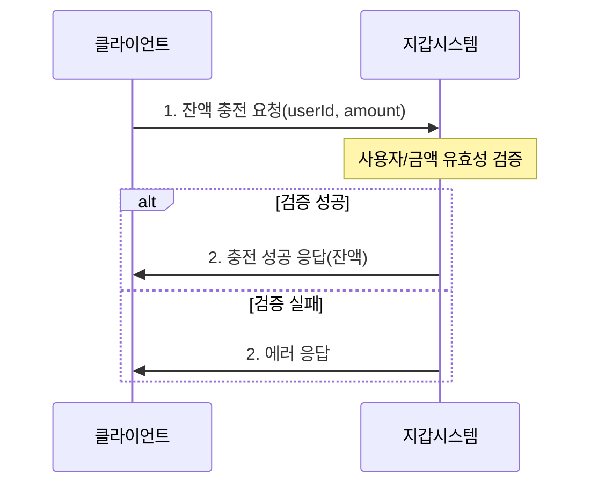

```mermaid
sequenceDiagram
    participant Client as 클라이언트
    participant WalletSystem as 지갑시스템
    
    Client->>WalletSystem: 1. 잔액 충전 요청(userId, amount)
    Note over WalletSystem: 사용자/금액 유효성 검증
    
    alt 검증 성공
        WalletSystem->>Client: 2. 충전 성공 응답(잔액)
    else 검증 실패
        WalletSystem->>Client: 2. 에러 응답
    end
```