

잔액 충전 시퀀스 다이어그램

<h2>잔액 충전 시퀀스 다이어그램</h2>

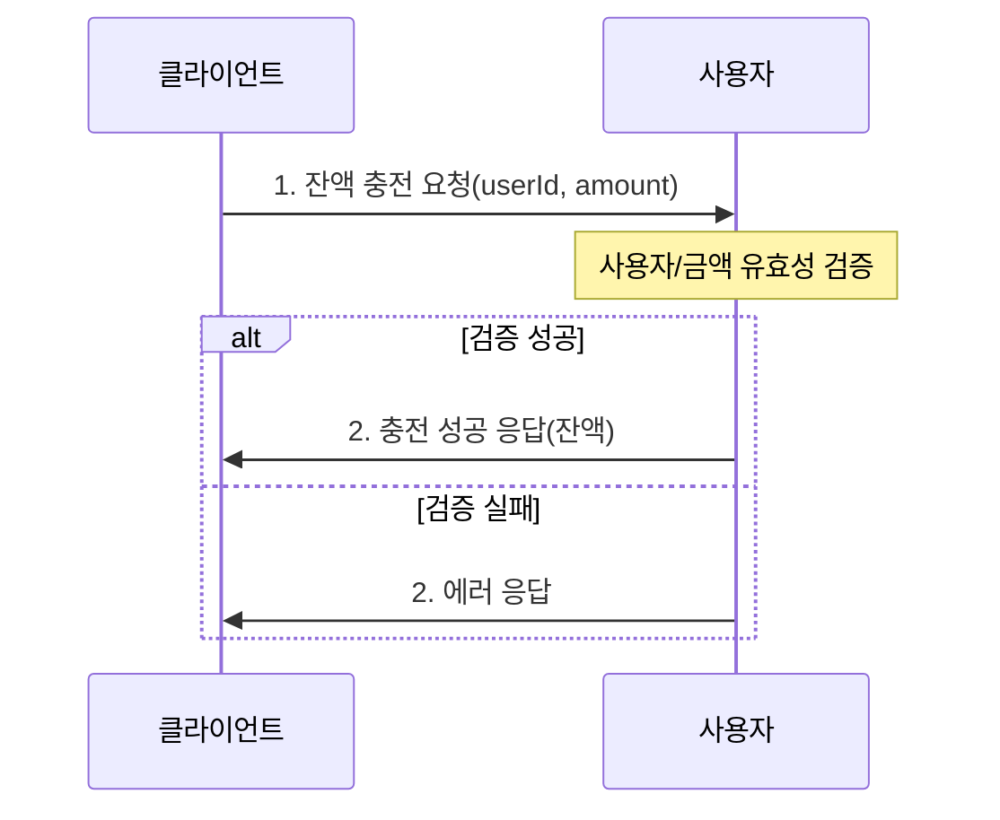

잔액 조회 시퀀스 다이어그램

<h2>잔액 조회 시퀀스 다이어그램</h2>

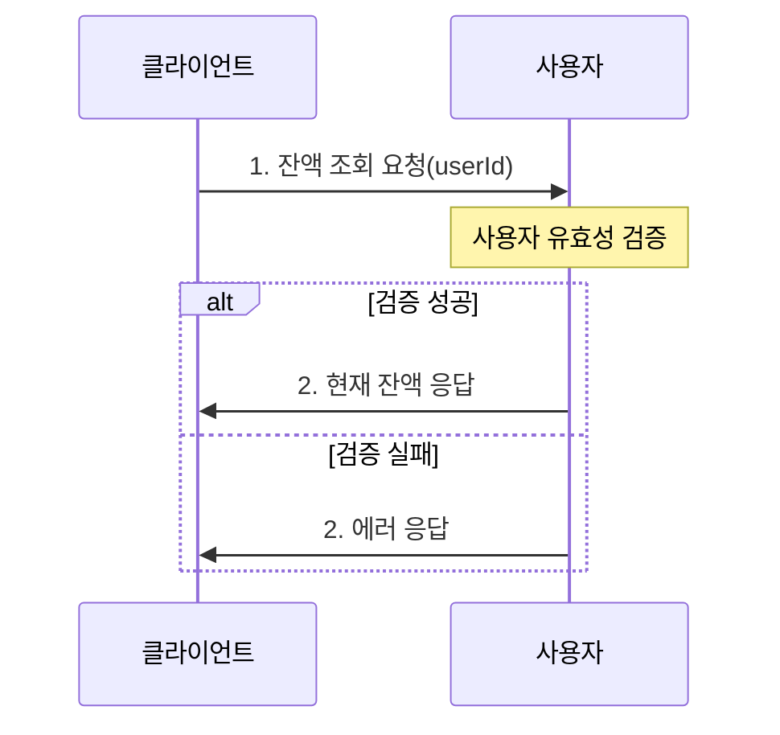

상품 조회 시퀀스 다이어그램

<h2>상품 조회 시퀀스 다이어그램</h2>

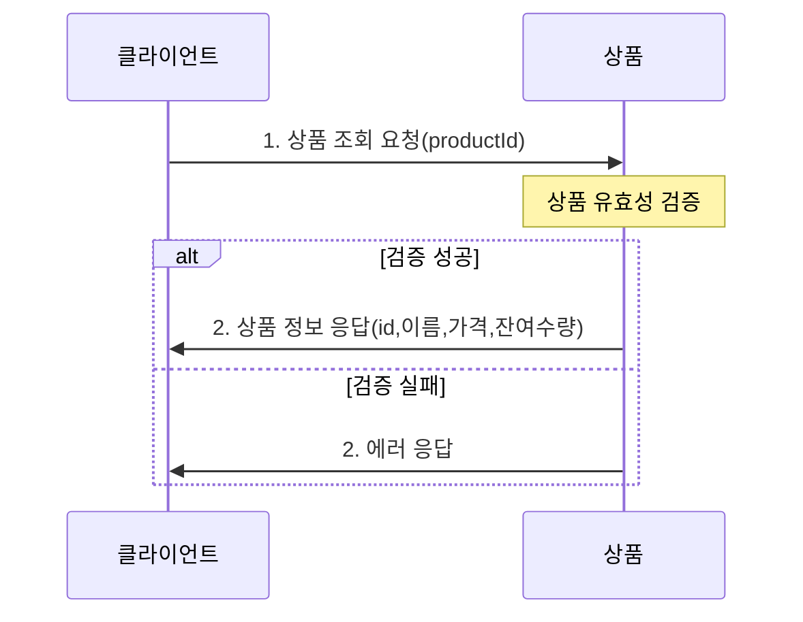

주문/결제 시퀀스 다이어그램

<h2>주문/결제 통합 시퀀스 다이어그램</h2>

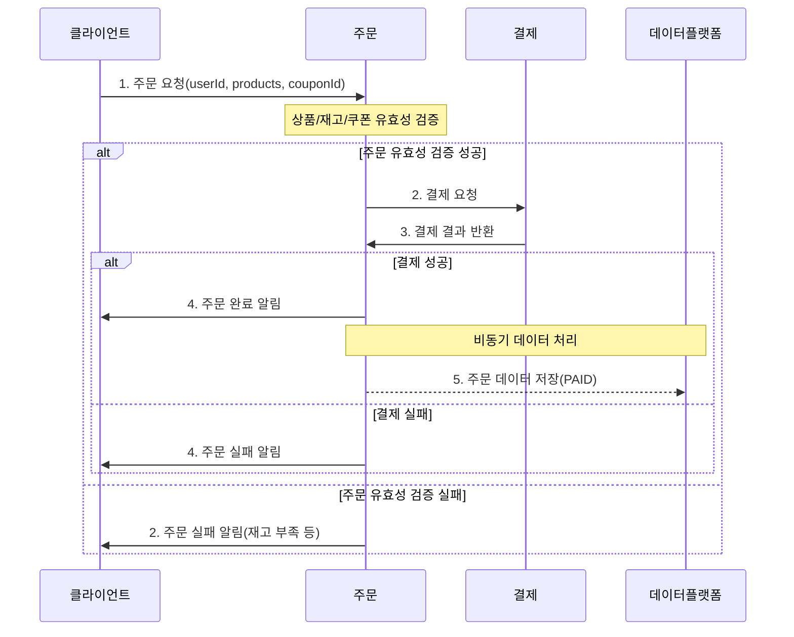

a.주문 상세 시퀀스 다이어그램

<h2>a.주문 상세 시퀀스 다이어그램</h2>

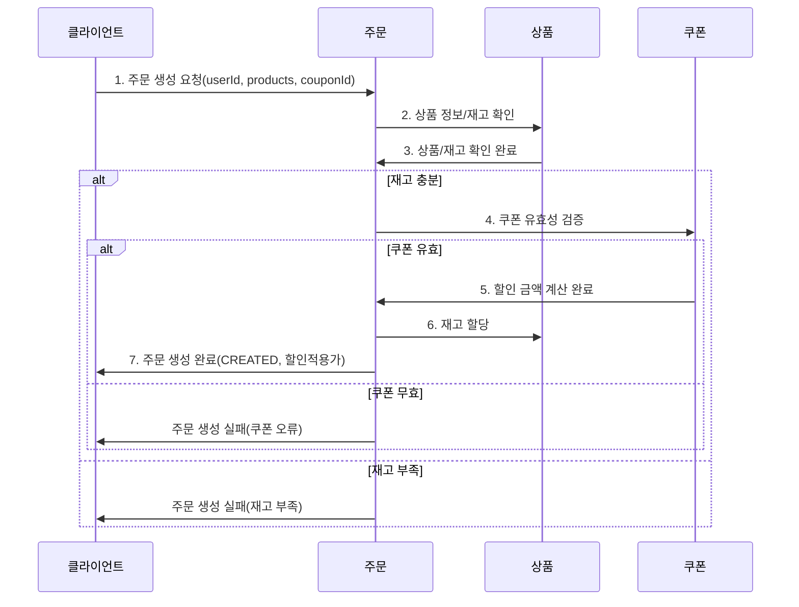

b.결제 상세 시퀀스 다이어그램

<h2>b.결제 상세 시퀀스 다이어그램</h2>

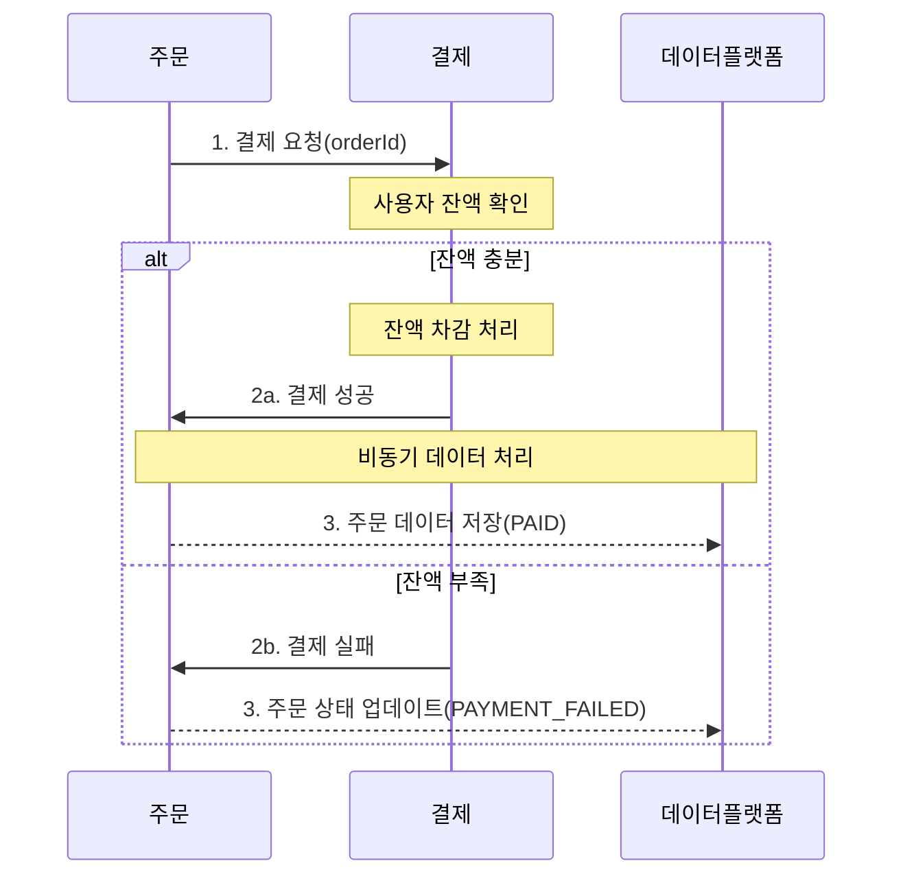

선착순 쿠폰 발급 시퀀스 다이어그램

<h2>선착순 쿠폰 발급 시퀀스 다이어그램</h2>

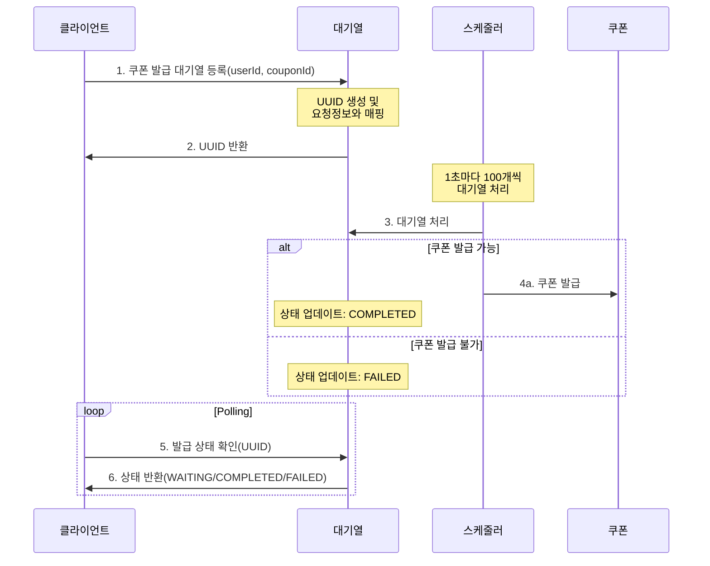

a.대기열 등록 시퀀스 다이어그램

<h2>a.대기열 등록 시퀀스 다이어그램</h2>

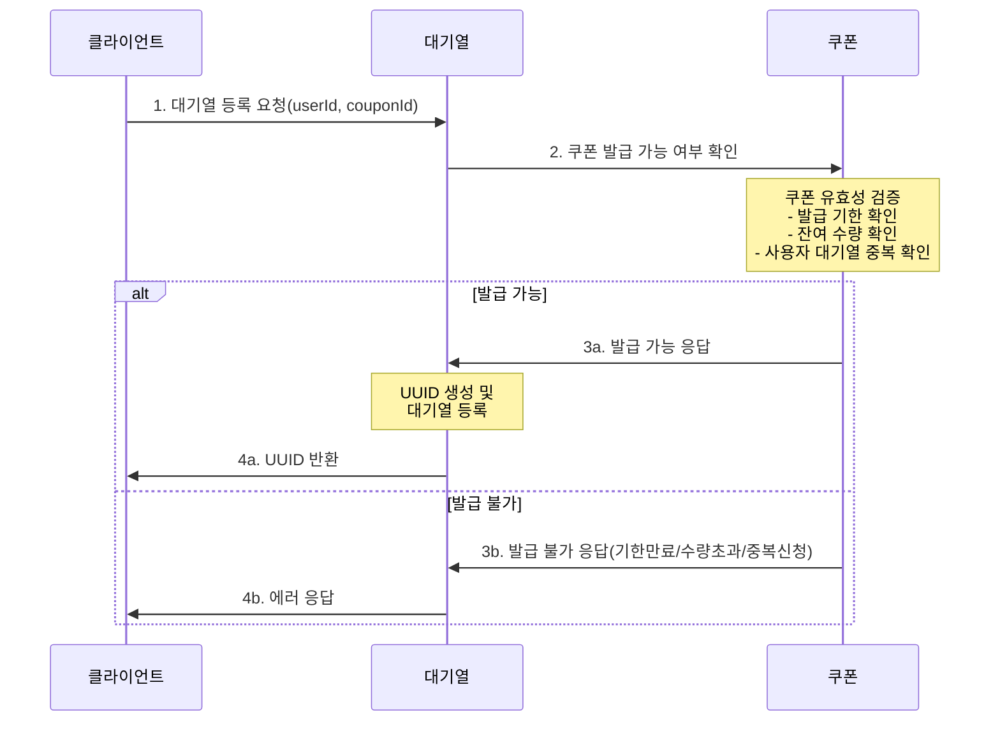

b.대기열 처리 스케줄러 시퀀스 다이어그램

<h2>b.대기열 처리 스케줄러 시퀀스 다이어그램</h2>

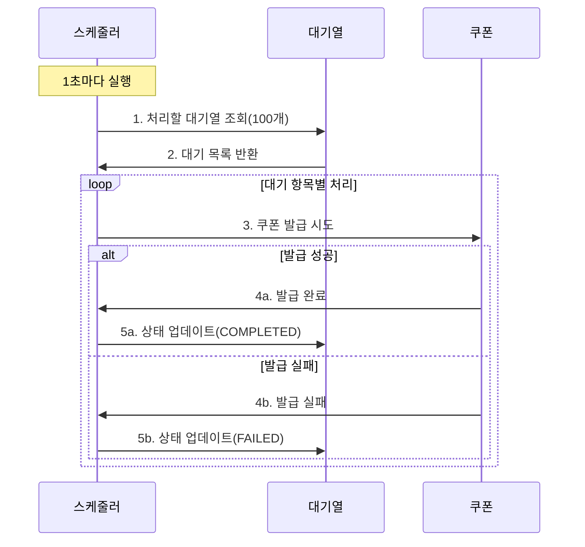

c.발급 확인 시퀀스 다이어그램

<h2>c.발급 확인 시퀀스 다이어그램</h2>

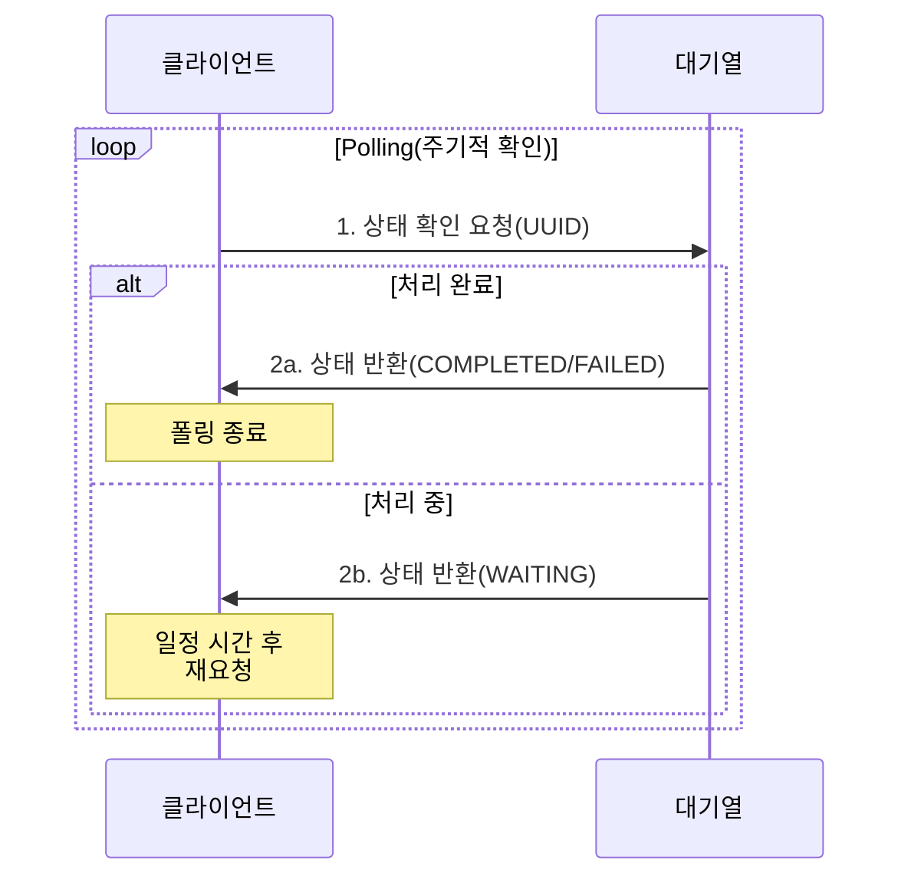

보유 쿠폰 목록 조회 시퀀스 다이어그램

<h2>보유 쿠폰 목록 조회 시퀀스 다이어그램</h2>

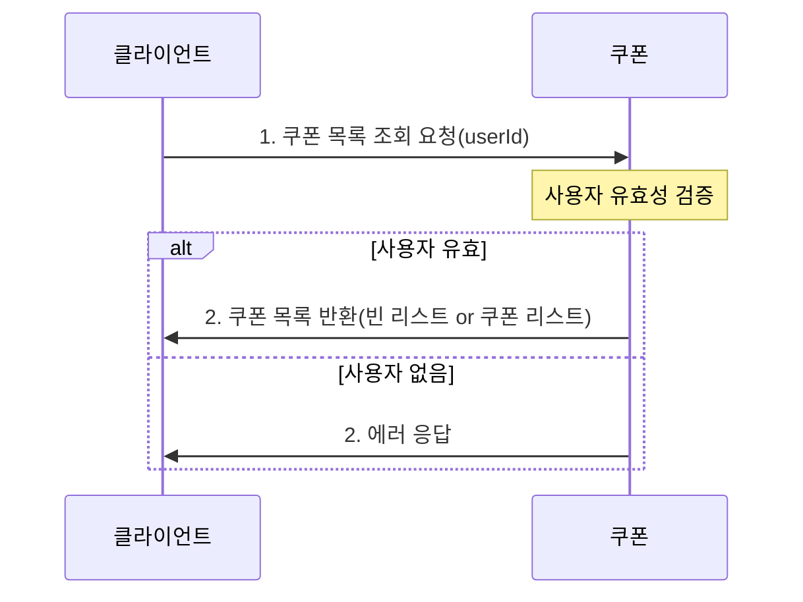

